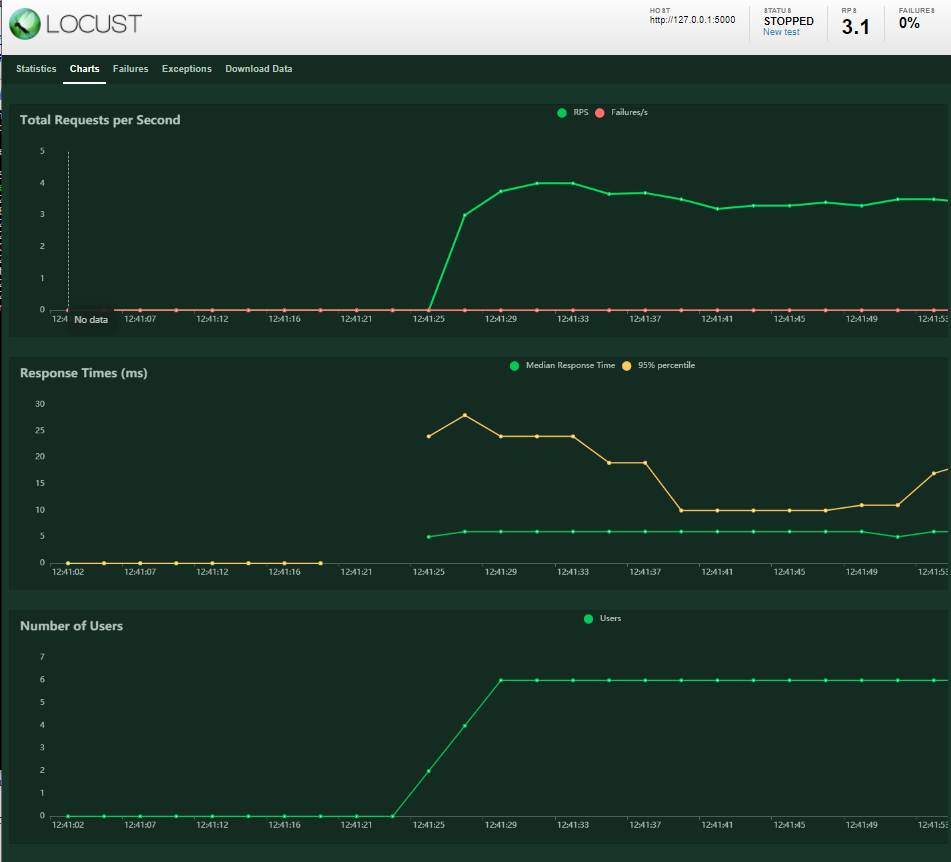

# Goodlift v1

**_Projet réalisé lors de ma formation de Développeur d'application Python à OpenClassrooms_**

* Ce projet est fonctionne sous Flask

* J'ai créé des test unitaires, d'intégrations avec pytest + effectué des test  fonctionnels 

* J'ai réalisé des débogages et des corrections (hotfixs) et intégrer une nouvelle fonctionnalité (feature)

* J'ai vérifié la couverture des tests avec Coverage

* J'ai effectué le linting avec Flake8

* J'ai créé un rapport de performance avec Locust

1. Présentation de l'application

	C'est une application simple et facile d'inscription en ligne aux compétitions de soulevé de terre grâce à un système de points.

    Il s'agit d'un projet en phase de POC (proof of concept) pour montrer un version légère de l'application aux utilisateurs et de l'améliorer en fonction de leurs feedbacks.

2. Prérequis

    * Python v3.x+

    * [Flask](https://flask.palletsprojects.com/en/1.1.x/)

3. Installation pour Windows10 avec terminal powershell

    - Clôner le projet sur votre poste `git clone https://github.com/nicot3m/goodlift.git`
	
	- Renommer le répertoire en GOODLIFT pour ne pas avoir à le modifier dans les fichiers de tests
	
	- Se placer dans le répertoire
	
	- Créer l'environnement virtuel `python -m venv env`
	
	- Remarque, pour changer le Set-ExecutionPolicy de windows (à faire une fois), `Set-ExecutionPolicy -ExecutionPolicy RemoteSigned -Scope CurrentUser`
	
	- Activer l'environnement virtuel `.\env\Scripts\Activate.ps1`
	
	- Remarque pour un terminal cmd, c'est la commande `env\Scripts\activate.bat`
	
	- Remarque, pour désactiver l'environnement virtuel `deactivate`

	- Installer les bibliothèques `pip install --requirement requirements.txt`
	
	- Remarque, pour mettre à jour le fichier requirements.txt `pip freeze > requirements.txt`

    - La variable d'environnement "app.secret_key" de Flask est définie dans le fichier server.py
	
	- Saisir la commande `$env:FLASK_APP = "server.py"`
	
	- Remarque pour un terminal cmd, c'est la commande `set FLASK_APP=server.py`
	
	- Lancer flask `flask run`

	- Aller sur `http://127.0.0.1:5000/` dans un navigateur.

4. Configuration actuelle

    Pour l'instant, une db n'est pas nécessaire, mais il y a deux fichiers json :
	
    * competitions.json - la liste des competitions
    * clubs.json - la liste des clubs
	
	Les adresses emails des clubs pour se connecter à l'application sont :
	* john@simplylift.co
	* kate@shelifts.co.uk
	* admin@irontemple.com

5. Tests
	
	- Lancer les tests avec `pytest`
	
6. Couverture de tests
	
	- Pour voir la couverture de test, utiliser le fichier config .coveragerc avec les fichiers python omis
	
	- supprimer .coverage et htmlcov si ils existent avec `coverage erase`
	
	- Lancer coverage `coverage run -m pytest`
	
	- `coverage report -m`
	
	- `coverage html` → Le rapport est dans le répertoire htmlcov

7. Le linting PEP8

	- Fichier conf .flake8
	- `flake8`

8. Rapport de performance

	- Test définis dans locustfile.py
	
	- Il faut lancer flask au préalable dans une 1ere fenêtre
	
	- Dans une 2e fenêtre lancer locust `locust`
	
	- Dans le navigateur `http://localhost:8089` 
	
	- Utilisateurs : 6
	
	- Spawn rate : 1
	
	- Host : http://127.0.0.1:5000

